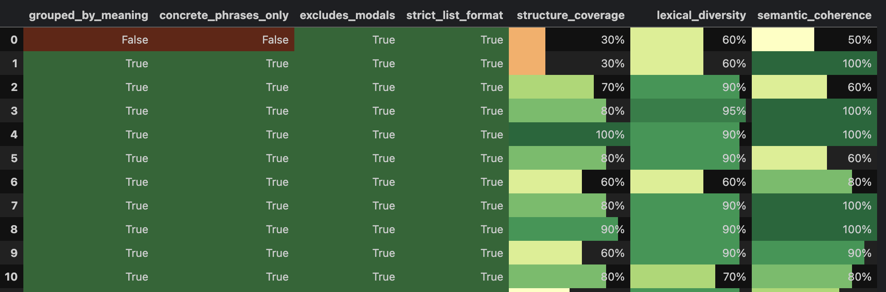

# Prompt Optimizer

Uses an AI model's domain knowledge to optimize prompts and measure output quality.

1. Choose a capable model with enough domain knowledge for quality control.
2. Provide a task description and representative input data.
3. Prompt Optimizer generates a task-specific rating schema.
4. It runs one or more executor models on sampled input data.
5. It analyzes the results and rewrites the prompt to improve measured quality.

Model names are anonimized for analyzis and prompting to avoid bias.



## Installation

```bash
python -m pip install "prompt-optimizer @ git+https://github.com/OVPavlov/prompt-optimizer.git"
```

## API key configuration

Pass an API key directly:
```python
from prompt_optimizer import LLMClient
client = LLMClient.openrouter(api_key="...")
```
Or set one of these environment variables, then create the corresponding client:
```python
client = LLMClient.openrouter()
# client = LLMClient.openai()
```

## Basic usage

```python
from prompt_optimizer import PromptOptimizer, LLMClient

client = LLMClient.openrouter()

task_description = """
Describe the executor's task, required output, and correctness constraints.
"""

input_data = [
    "input item 1",
    "input item 2",
    "input item 3",
]

executor_models = [
    'google/gemma-4-31b-it',
    'openai/gpt-5-mini',
]

optimizer = PromptOptimizer.create_standard(
    directory="experiments/example",
    task_description=task_description,
    all_data=input_data,
    client=client,
    models=executor_models,
    main_model='google/gemini-3.1-pro-preview')

optimizer.run_experiments(iterations=3, num_data=3)
```

Use the constructor when you need explicit control over the meta-prompt, analysis, and prompt-generation models:
```python
optimizer = PromptOptimizer(
    directory="experiments/example",
    task_description=task_description,
    all_data=input_data,
    client=client,
    meta_prompt_model=client.get_reasoning_model('google/gemini-3.1-pro-preview', effort="high"),
    analysis_model=client.get_reasoning_model('google/gemini-3.1-pro-preview', effort="low"),
    prompt_model=client.get_reasoning_model('google/gemini-3.1-pro-preview', effort="medium"),
    models=executor_models)
```

Set `use_task_as_first_prompt=True` to use the task description directly instead of generating an initial prompt.

## Resume an experiment

```python
from prompt_optimizer import PromptOptimizer

optimizer = PromptOptimizer.load("experiments/example")
optimizer.run_experiments(iterations=2, num_data=8)
```

`load()` reconstructs the client and models from saved parameters. The matching API key must still be available through the environment.

`num_data` is the number of input data items for each model for each iteration.

## Inspect results

Display ratings for all executor models:

```python
optimizer.display_all_models()
```

Display one model:

```python
optimizer.display_model("provider/executor-model-a")
```

Print the input/output pairs from one iteration:

```python
optimizer.print_outputs("provider/executor-model-a", iteration=0)
```

Access structured iteration data:

```python
iteration = optimizer.dataset.get_i(0)
model_result = optimizer.dataset.get_mr("provider/executor-model-a", 0)

print(iteration.prompt)
print(model_result.analysis)
print(model_result.rating)
```

Inspect generated prompt history:

```python
context = optimizer.prompt_generator.get_all_models_context(
    optimizer.dataset,
    optimizer.values.to_anon,
)
print(context)
```

## Cost, token, and latency statistics

```python
optimizer.display_stats()
optimizer.get_stats_avg()
optimizer.get_stats_sum()
optimizer.get_cost()
optimizer.get_latencies()
```

Statistics are persisted under the experiment directory and restored by `PromptOptimizer.load()`.

## Select executor models

Remove models from subsequent iterations:

```python
optimizer.values.remove_models(
    ["provider/executor-model-b"],
    reshuffle=True,
)
```

Replace an executor model configuration:

```python
optimizer.ll_models["provider/executor-model-a"] = (
    client.get_reasoning_model(
        "provider/executor-model-a",
        effort="medium",
        stats_path=optimizer.llm_stats_path,
        stats_key="executor-model-a-medium",
    )
)
```
